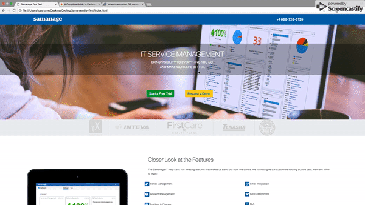
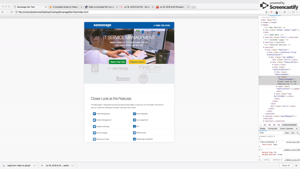
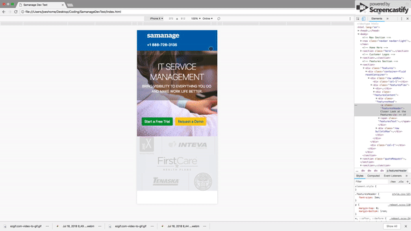

# Samanage Dev Test

In this exercise, I was asked by the great team at Samanage to demonstrate my front end dev skills on a quick exercise.  Provided with a .psd file, I was to create and mobilize the site.

No branching strategy was utilized, as the total project was completed in 3 commits.

To view the deployed page, click [here](https://joewrightnc.github.io/SamanageDevTest/).

## Technology
On the frontend, the app uses `HTML5`, `CSS3`, and `Bootstrap 4.0`.  The general page utilized flexbox heavily and in a few different ways to demonstrate proficiency. 
There is no backend component to this application.

## Install Locally
  1. To install locally, clone the repo to a local directory and then access that directory in the browser.

## Gifs of Desktop, Tablet, and Phone
#### Application on a desktop monitor.

#### Application on an iPad

#### Application on an iPhone

